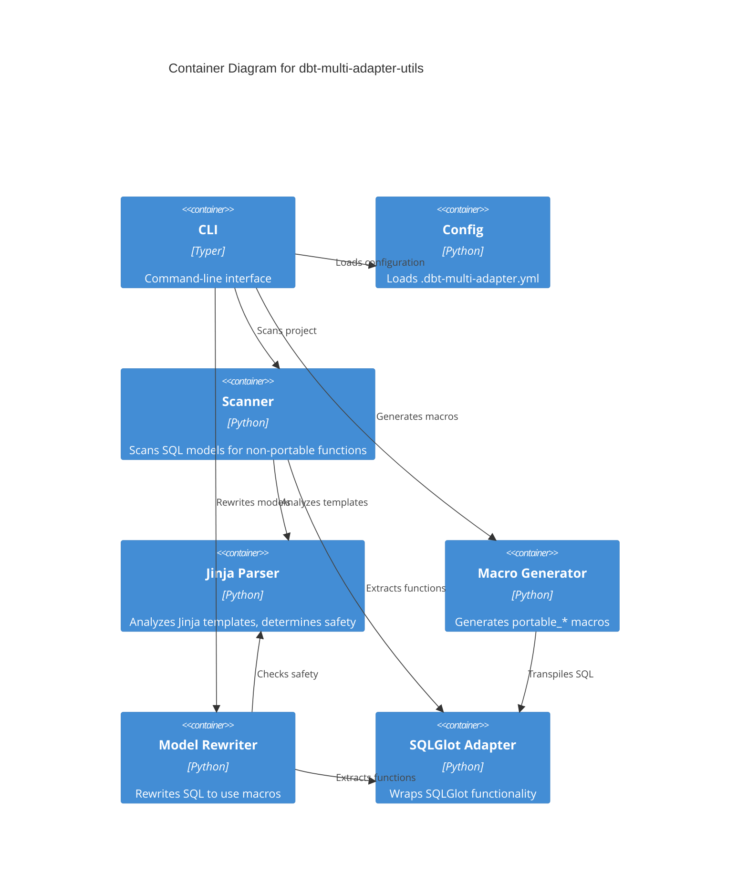

# dbt-multi-adapter-utils

A CLI code generator that automates cross-database compatibility for dbt projects.

## Why This Exists

dbt v1.8 (May 2024) introduced native [unit tests](https://docs.getdbt.com/docs/build/unit-tests) that validate SQL model logic against static inputs. However, unit tests require a database target, and using production databases (Snowflake, Databricks, BigQuery) for local testing has drawbacks:

- Slow: cloud warehouse spin-up adds seconds to every test run
- Expensive: running tests costs real money
- Complex: requires network access, credentials, and warehouse management

Running unit tests locally against DuckDB solves these problems, but creates a portability issue:

```sql
-- Production Spark model
SELECT COLLECT_LIST(item_id) as items FROM orders

-- DuckDB doesn't understand COLLECT_LIST
```

This tool generates portable macros that work across adapters:

```sql
-- Works on Spark, DuckDB, and other adapters
SELECT {{ portable_collect_list('item_id') }} as items FROM orders
```

## Quick Start

See [example_project/](example_project/) for a hands-on demo with Spark to Postgres/Snowflake migration.

```bash
cd example_project
./demo.sh
```

## Features

- Scans dbt models to detect non-portable database functions
- Generates dbt macros with adapter-specific implementations using SQLGlot
- Rewrites models to use generated macros
- No runtime dependency required

This is a code generator, not a package dependency. After running it, the generated macros are part of your project.

## Installation

This tool is currently under development and not yet published to PyPI.

For development setup:

```bash
# Clone the repository
git clone https://github.com/yourusername/dbt-multi-adapter-utils
cd dbt-multi-adapter-utils

# Install with uv
uv sync
```

## Usage

### Commands

```bash
# Scan project
dbt-multi-adapter-utils scan

# Generate macros
dbt-multi-adapter-utils generate

# Rewrite models (preview first)
dbt-multi-adapter-utils rewrite --dry-run
dbt-multi-adapter-utils rewrite

# All-in-one
dbt-multi-adapter-utils migrate
```

### Example

Before (Spark-specific):

```sql
SELECT
    user_id,
    COLLECT_LIST(DISTINCT page_url) as visited_pages,
    DATE_TRUNC('month', activity_date) as month
FROM user_activities
GROUP BY user_id, month
```

After running `dbt-multi-adapter-utils migrate`, a macro is generated in `macros/portable_functions.sql`:

```sql

    {{ return(adapter.dispatch('collect_list', 'portable')(expression)) }}



    COLLECT_LIST({{ expression }})



    ARRAY_AGG({{ expression }})

```

The model now works across all configured adapters.

## Configuration

Create `.dbt-multi-adapter.yml` in your project root:

```yaml
adapters:
  - postgres
  - snowflake
  - bigquery

macro_output: macros/portable_functions.sql

scan_project: true

model_paths:
  - models
```

## Use Cases

### 1. Local Unit Testing with DuckDB

Run unit tests against DuckDB locally while deploying to production databases like Snowflake, Spark, or BigQuery.

```yaml
# .dbt-multi-adapter.yml
adapters:
  - snowflake
  - duckdb
```

After running `dbt-multi-adapter-utils migrate`:

- Run `dbt test --target duckdb` locally
- Deploy to `--target snowflake` in production

### 2. Multi-Cloud Deployment

Support customers using different cloud warehouses (Snowflake, Databricks, BigQuery) with a single dbt project.

Generate portable macros for all target platforms to maintain one codebase that deploys anywhere.

### 3. Database Migration

Migrating from one database to another (e.g., Spark to Snowflake) with hundreds of models using database-specific SQL.

Run `dbt-multi-adapter-utils migrate` to rewrite models with portable macros, allowing testing on both platforms during the migration period.

## Architecture

### Component Architecture



### How It Works

#### 1. Function Detection with SQLGlot

The tool uses [SQLGlot](https://github.com/tobymao/sqlglot) to parse SQL and detect database-specific functions:

- Parses SQL into an AST (Abstract Syntax Tree)
- Identifies function calls in the SQL
- Transpiles each function to all target dialects and compares results to determine if rewriting is needed

#### 2. Jinja Template Handling

dbt models mix Jinja2 templates with SQL. The tool uses Jinja2's native lexer to tokenize templates without executing any code or loading dbt context. This token-based approach classifies template regions:

1. STATIC - Pure SQL: `SELECT * FROM users`
2. SAFE_EXPRESSION - dbt helpers: `{{ ref('users') }}`, `{{ var('x') }}`
3. CONTROL_FLOW - Logic: ``, ``
4. UNSAFE - Complex expressions: `{{ custom_macro() }}`

The lexer handles all edge cases correctly, including nested function calls like `{{ ref(var('table_name')) }}` and strings containing Jinja delimiters.

The tool can handle control flow by masking it as a placeholder during SQL parsing:

```sql
SELECT
  user_id,
  
  deleted_at,
  
  created_at
FROM users
-- Masked for parsing: "SELECT user_id, __JINJA__, deleted_at, __JINJA__, created_at"
```

Only files with unsafe/complex Jinja expressions are skipped to avoid breaking templates.

#### 3. Macro Generation

Generated macros use dbt's `adapter.dispatch()` pattern. Each macro takes a single `expression` parameter containing all function arguments:

```sql

    {{ return(adapter.dispatch('collect_list', 'portable')(expression)) }}



    COLLECT_LIST({{ expression }})



    ARRAY_AGG({{ expression }})

```

#### 4. Model Rewriting

The tool rewrites function calls by replacing them with macro calls:

```sql
-- Before
SELECT COLLECT_LIST(item_id) FROM orders

-- After
SELECT {{ portable_collect_list('item_id') }} FROM orders
```

For functions with multiple arguments, all arguments are passed as a single string:

```sql
-- Before
DATE_TRUNC('month', created_at)

-- After
{{ portable_date_trunc('month', created_at) }}
```

All Jinja expressions (like `{{ ref() }}`) are preserved exactly as written.

## Development

### Setup

```bash
# Clone the repository
git clone https://github.com/yourusername/dbt-multi-adapter-utils
cd dbt-multi-adapter-utils

# Install with uv (includes dev dependencies)
uv sync

# Install pre-commit hooks
uv run pre-commit install
```

### Pre-commit Hooks

This project uses pre-commit hooks to ensure code quality:

- **Ruff** - Fast Python linter and formatter
- **Pyrefly** - Fast Python type checker from Meta (written in Rust)

Hooks run automatically on `git commit`. To run manually:

```bash
# Run on all files
uv run pre-commit run --all-files

# Run specific hook
uv run pre-commit run ruff-check
uv run pre-commit run pyrefly-typecheck-specific-version
```

### Testing

```bash
# Run unit tests
make test

# Run integration tests (fast - DuckDB only)
make integration-tests-fast

# Run all integration tests (includes Spark - slow)
make integration-tests

# Run linter
make lint

# Auto-fix linting issues
make lint-fix
```

## Contributing

Author and maintainer: Edmondo Porcu ([edmondo.porcu@gmail.com](mailto:edmondo.porcu@gmail.com))

Contributions are welcome. Submit issues and pull requests on GitHub.
